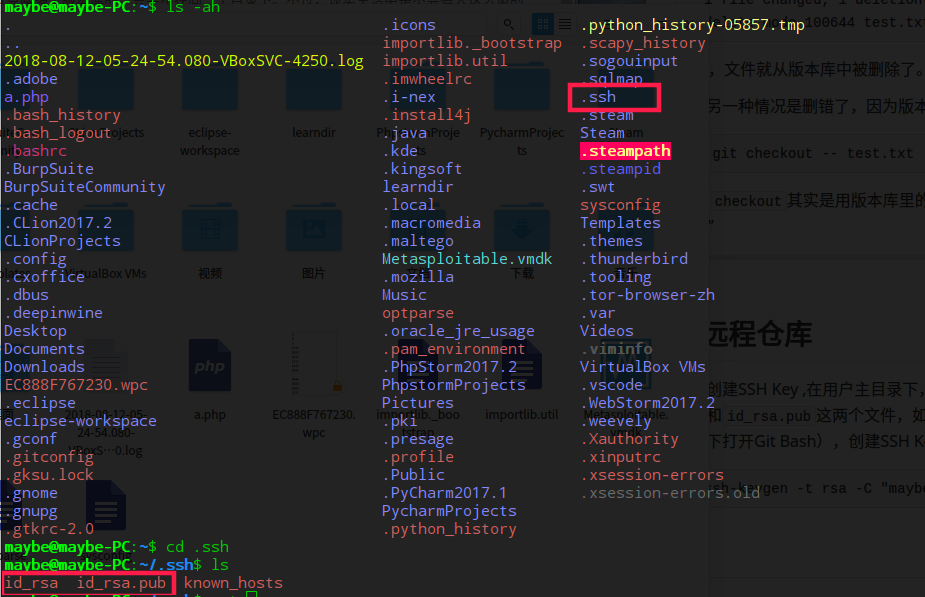
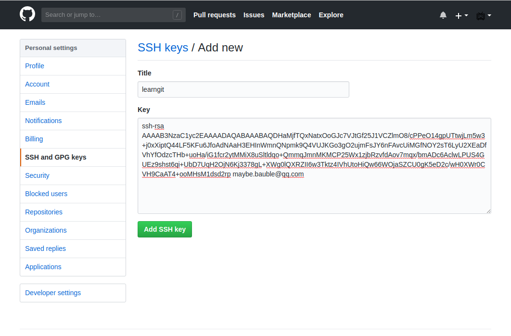

# GIT使用教程

## 1.创建版本库

- 安装完git后,需要一步设置

```
$git config --global user.name "Your name"
$git config --global user.email "email@example.com"
```

- 选择一个合适的地方创建一个空目录

```
$mkdir learndir
$cd learndir
$ pwd
/home/maybe/learndir
```

- 通过`git init`命令把这个目录变成Git可以管理的仓库

```
$ git init
已初始化空的 Git 仓库于 /home/maybe/learndir/.git/
```

> 可以使用ls -ah命令查看当前目录下是否有 .git文件夹

- 把文件添加到版本库

1. 用命令`git add`告诉Git,把文件添加到仓库

```
$git add readme.txt
```

2. 用命令`git commit`告诉Git,把文件提交到仓库

```
$ git commit -m "wrote a readme file"
[master（根提交） d42d4a0] wrote a readme file
 1 file changed, 2 insertions(+)
 create mode 100644 readme.txt
```

> > -m后面输入的是本次提交的说明,可以输入任意内容
> >
> > git commit 命令执行成功会告诉你 ,1 file changed:一个文件被改动. 2 insertions:插入两行内容


> 做完上面操作,对文件进行一次修改


- 文件改动后,运行`git status`命令

```
$ git status
位于分支 master
尚未暂存以备提交的变更：
  （使用 "git add <文件>..." 更新要提交的内容）
  （使用 "git checkout -- <文件>..." 丢弃工作区的改动）

	修改：     readme.txt

修改尚未加入提交（使用 "git add" 和/或 "git commit -a"）
```

> git status命令可以让我们时刻掌握仓库当前的状态,上面的命令输出告诉我们，`readme.txt`被修改过了git diff顾名思义就是查看difference，显示的格式正是Unix通用的diff格式，可以从上面的命令输出看到，我们在第一行添加了一个distributed单词。，但还没有准备提交的修改。

- 运行`git diff `查看修改

```
$ git diff
diff --git a/readme.txt b/readme.txt
index d8036c1..013b5bc 100644
--- a/readme.txt
+++ b/readme.txt
@@ -1,2 +1,2 @@
-Git is a version control system.
+Git is a distributed version control system.
 Git is free software.
\ No newline at end of file
```

> `git diff`顾名思义就是查看difference，显示的格式正是Unix通用的diff格式，可以从上面的命令输出看到，我们在第一行添加了一个`distributed`单词。

----


## 2.版本回退

> 第二次修改`readme.txt`文件

```
$ git add readme.txt
$ git commit -m "append GPL"
[master 1094adb] append GPL
 1 file changed, 1 insertion(+), 1 deletion(-)
```

- 使用`git log`命令查看版本控制系统中的文件历史记录

```
$ git log
commit 0b10c4784e5c27ebdf40bb0f741fe44cd857c80f (HEAD -> master)
Author: Maybe <maybe.bauble@qq.com>
Date:   Mon Aug 13 10:09:44 2018 +0800

    append GPL

commit a592dc33d93a621dc840334a322b53b159fb5dd1
Author: Maybe <maybe.bauble@qq.com>
Date:   Mon Aug 13 10:06:36 2018 +0800

    add distributed

commit d42d4a09971e95f69914d5470d77f22cb5963a92
Author: Maybe <maybe.bauble@qq.com>
Date:   Mon Aug 13 09:56:14 2018 +0800

    wrote a readme file
```

> `git log`命令显示从最近到最远的提交日志，我们可以看到3次提交，最近的一次是`append GPL`，上一次是`add distributed`，最早的一次是`wrote a readme file`。

如果嫌输出信息太多，看得眼花缭乱的，可以试试加上`--pretty=oneline`参数：

```
$ git log --pretty=oneline
0b10c4784e5c27ebdf40bb0f741fe44cd857c80f (HEAD -> master) append GPL
a592dc33d93a621dc840334a322b53b159fb5dd1 add distributed
d42d4a09971e95f69914d5470d77f22cb5963a92 wrote a readme file
```

**提示:**你看到的一大串类似`0b10c47...`的是`commit id`（版本号）.Git的`commit id`不是1，2，3……递增的数字，而是一个SHA1计算出来的一个非常大的数字，用十六进制表示，而且你看到的`commit id`和我的肯定不一样，以你自己的为准。

- 使用`git reset`把当前版本`append GPL`回退到上一个版本`add distributed`

```
git reset --hard HEAD^
HEAD 现在位于 a592dc3 add distributed
```

如果需要返回未来的append GPL版本需要找到`commit id`,执行下面命令:

```
$ git reset --hard 0b10c
HEAD 现在位于 0b10c47 append GPL
$ cat readme.txt
Git is a distributed version control system.
Git is free software distributed under the GPL.
```

- Git提供一个命令`git reflog`用来记录你的每一次命令

```
$ git reflog
0b10c47 (HEAD -> master) HEAD@{0}: reset: moving to 0b10c
a592dc3 HEAD@{1}: reset: moving to HEAD^
0b10c47 (HEAD -> master) HEAD@{2}: commit: append GPL
a592dc3 HEAD@{3}: commit: add distributed
d42d4a0 HEAD@{4}: commit (initial): wrote a readme file
```

---


## 3.撤销修改

- `git checkout --file`可以丢弃工作区的修改:

```
$git checkout -- readme.txt
```

> 命令`git checkout -- readme.txt`意思就是，把`readme.txt`文件在工作区的修改全部撤销

可以分为两种情况:

1.`readme.txt`自修改后还没有被放到暂存区，现在，撤销修改就回到和版本库一模一样的状态；

2.`readme.txt`已经添加到暂存区后，又作了修改，现在，撤销修改就回到添加到暂存区后的状态。

- 用命令`git reset HEAD <file>`可以把暂存区的修改撤销掉（unstage），重新放回工作区：

```
$ git reset HEAD readme.txt
重置后取消暂存的变更：
M	readme.txt
```

> `git reset`命令既可以回退版本，也可以把暂存区的修改回退到工作区。当我们用`HEAD`时，表示最新的版本。

```
$ git checkout -- readme.txt
maybe@maybe-PC:~/learndir$ git status
位于分支 master
无文件要提交，干净的工作区
```

---


## 3.删除文件

添加一个新的文件:

```
$leafpad test.txt
$ git add test.txt
$ git commit -m "add test.txt"
[master 0ba9053] add test.txt
 1 file changed, 1 insertion(+)
 create mode 100644 test.txt
```

- 一般情况下，你通常直接在文件管理器中把没用的文件删了，或者用`rm`命令删了：

```
$ rm test.txt
```

- 这个时候，Git知道你删除了文件，因此，工作区和版本库就不一致了，`git status`命令会立刻告诉你哪些文件被删除了：

```
$ git status
On branch master
Changes not staged for commit:
  (use "git add/rm <file>..." to update what will be committed)
  (use "git checkout -- <file>..." to discard changes in working directory)

    deleted:    test.txt

no changes added to commit (use "git add" and/or "git commit -a")

```

- 现在你有两个选择:

1. 一是确实要从版本库中删除该文件，那就用命令`git rm`删掉，并且`git commit`：

```
$ git rm test.txt
rm 'test.txt'

$ git commit -m "remove test.txt"
[master d46f35e] remove test.txt
 1 file changed, 1 deletion(-)
 delete mode 100644 test.txt
```

现在，文件就从版本库中被删除了。

2. 另一种情况是删错了，因为版本库里还有呢，所以可以很轻松地把误删的文件恢复到最新版本：

```
$ git checkout -- test.txt
```

`git checkout`其实是用版本库里的版本替换工作区的版本，无论工作区是修改还是删除，都可以“一键还原”

---


## 4.远程仓库

- 创建SSH Key ,在用户主目录下，看看有没有.ssh目录，如果有，再看看这个目录下有没有`id_rsa`和`id_rsa.pub`这两个文件，如果已经有了，可直接跳到下一步。如果没有，打开Shell（Windows下打开Git Bash），创建SSH Key：

```
$ssh-keygen -t rsa -C "maybe.bauble@qq.com"
```



> 把邮件地址换成你自己的邮件地址，然后一路回车，使用默认值即可，由于这个Key也不是用于军事目的，所以也无需设置密码。

- 登陆GitHub，打开“Account settings”，“SSH Keys”页面：点“Add SSH Key”，填上任意Title，在Key文本框里粘贴`id_rsa.pub`文件的内容：



> 为什么GitHub需要SSH Key呢？因为GitHub需要识别出你推送的提交确实是你推送的，而不是别人冒充的，而Git支持SSH协议，所以，GitHub只要知道了你的公钥，就可以确认只有你自己才能推送。


你已经在本地创建了一个Git仓库后，又想在GitHub创建一个Git仓库，并且让这两个仓库进行远程同步，这样，GitHub上的仓库既可以作为备份，又可以让其他人通过该仓库来协作，真是一举多得。


- 首先，登陆GitHub，然后，在右上角找到“Create a new repo”按钮，创建一个新的仓库：


- 在Repository name填入`learngit`，其他保持默认设置，点击“Create repository”按钮，就成功地创建了一个新的Git仓库：


目前，在GitHub上的这个`learngit`仓库还是空的，GitHub告诉我们，可以从这个仓库克隆出新的仓库，也可以把一个已有的本地仓库与之关联，然后，把本地仓库的内容推送到GitHub仓库。

- 在本地learngit仓下运行命令:

```
$git remote add origin git@github.com:Mauble/learngit.git
```

- 把本地所有库的内容推送到远程库上:

```
$ git push -u origin master
The authenticity of host 'github.com (52.74.223.119)' can't be established.
RSA key fingerprint is SHA256:nThbg6kXUpJWGl7E1IGOCspRomTxdCARLviKw6E5SY8.
Are you sure you want to continue connecting (yes/no)? yes
Warning: Permanently added 'github.com,52.74.223.119' (RSA) to the list of known hosts.
对象计数中: 13, 完成.
Delta compression using up to 4 threads.
压缩对象中: 100% (9/9), 完成.
写入对象中: 100% (13/13), 1.10 KiB | 0 bytes/s, 完成.
Total 13 (delta 2), reused 0 (delta 0)
remote: Resolving deltas: 100% (2/2), done.
To github.com:Mauble/learngit.git
 * [new branch]      master -> master
分支 master 设置为跟踪来自 origin 的远程分支 master。
```

把本地库的内容推送到远程，用`git push`命令，实际上是把当前分支`master`推送到远程。

由于远程库是空的，我们第一次推送`master`分支时，加上了`-u`参数，Git不但会把本地的`master`分支内容推送的远程新的`master`分支，还会把本地的`master`分支和远程的`master`分支关联起来，在以后的推送或者拉取时就可以简化命令。

- 现在起,只要本地做了提交,就可以通过命令:

```
$git push origin master
```

把本地的分支的最新修改提交至github.

### SSH警告

当你第一次使用Git的`clone`或者`push`命令连接GitHub时，会得到一个警告：

```
The authenticity of host 'github.com (xx.xx.xx.xx)' can't be established.
RSA key fingerprint is xx.xx.xx.xx.xx.
Are you sure you want to continue connecting (yes/no)?

```

这是因为Git使用SSH连接，而SSH连接在第一次验证GitHub服务器的Key时，需要你确认GitHub的Key的指纹信息是否真的来自GitHub的服务器，输入`yes`回车即可。

Git会输出一个警告，告诉你已经把GitHub的Key添加到本机的一个信任列表里了：

```
Warning: Permanently added 'github.com' (RSA) to the list of known hosts.

```

这个警告只会出现一次，后面的操作就不会有任何警告了。

如果你实在担心有人冒充GitHub服务器，输入`yes`前可以对照[GitHub的RSA Key的指纹信息](https://help.github.com/articles/what-are-github-s-ssh-key-fingerprints/)是否与SSH连接给出的一致。

### 远程库克隆

- 用命令`git clone`克隆一个本地库:

```
$ git clone git@github.com:Mauble/gitskills.git
Cloning into 'gitskills'...
remote: Counting objects: 3, done.
remote: Total 3 (delta 0), reused 0 (delta 0), pack-reused 3
Receiving objects: 100% (3/3), done.
```

---


## 5.分支管理

(1).创建合并分支

- 创建`div`分支,然后切换到`div`分支:

```
$ git checkout -b dev
切换到一个新分支 'dev'
```

- `git checkout`命令加上`-b`参数表示创建并切换,相当于以下两条命令:

```
$git branch dev
$git checkout dev
Switched to branch 'dev'
```

- 使用`git branch`命令查看当前分支:

```
$ git branch
* dev
  master
```

> `git branch`命令会列出所有分支，当前分支前面会标一个`*`号。

然后，我们就可以在`dev`分支上正常提交，比如对readme.txt做个修改，加上一行：

```
Creating a new branch is quick.

```

然后提交：

```
$ git add readme.txt 
$ git commit -m "branch test"
[dev b17d20e] branch test
 1 file changed, 1 insertion(+)

```

现在，`dev`分支的工作完成，我们就可以切换回`master`分支：

```
$ git checkout master
Switched to branch 'master'

```

切换回`master`分支后，再查看一个readme.txt文件，刚才添加的内容不见了！因为那个提交是在`dev`分支上，而`master`分支此刻的提交点并没有变：


现在，我们把`dev`分支的工作成果合并到`master`分支上：

```
$ git merge dev
Updating d46f35e..b17d20e
Fast-forward
 readme.txt | 1 +
 1 file changed, 1 insertion(+)

```

`git merge`命令用于合并指定分支到当前分支。合并后，再查看readme.txt的内容，就可以看到，和`dev`分支的最新提交是完全一样的。

注意到上面的`Fast-forward`信息，Git告诉我们，这次合并是“快进模式”，也就是直接把`master`指向`dev`的当前提交，所以合并速度非常快。

当然，也不是每次合并都能`Fast-forward`，我们后面会讲其他方式的合并。

合并完成后，就可以放心地删除`dev`分支了：

```
$ git branch -d dev
Deleted branch dev (was b17d20e).

```

删除后，查看`branch`，就只剩下`master`分支了：

```
$ git branch
* master

```

因为创建、合并和删除分支非常快，所以Git鼓励你使用分支完成某个任务，合并后再删掉分支，这和直接在`master`分支上工作效果是一样的，但过程更安全。


## 总结

查看分支：`git branch`

创建分支：`git branch <name>`

切换分支：`git checkout <name>`

创建+切换分支：`git checkout -b <name>`

合并某分支到当前分支：`git merge <name>`

删除分支：`git branch -d <name>`