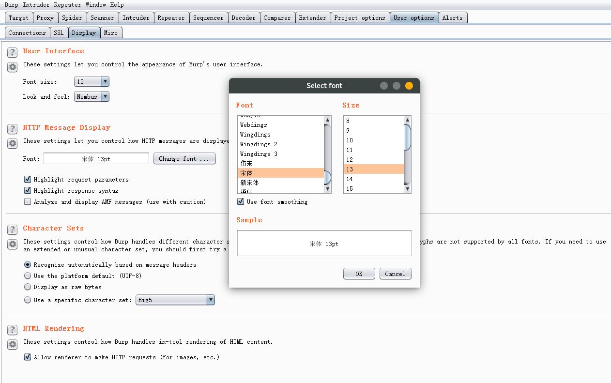
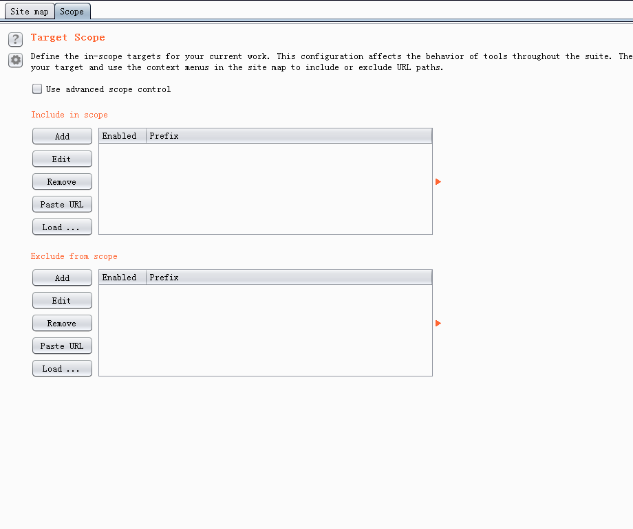
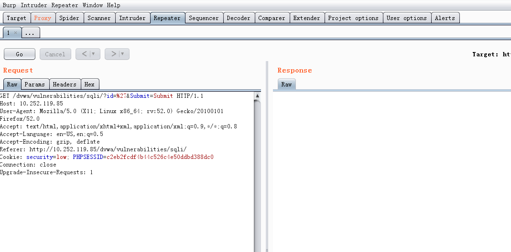
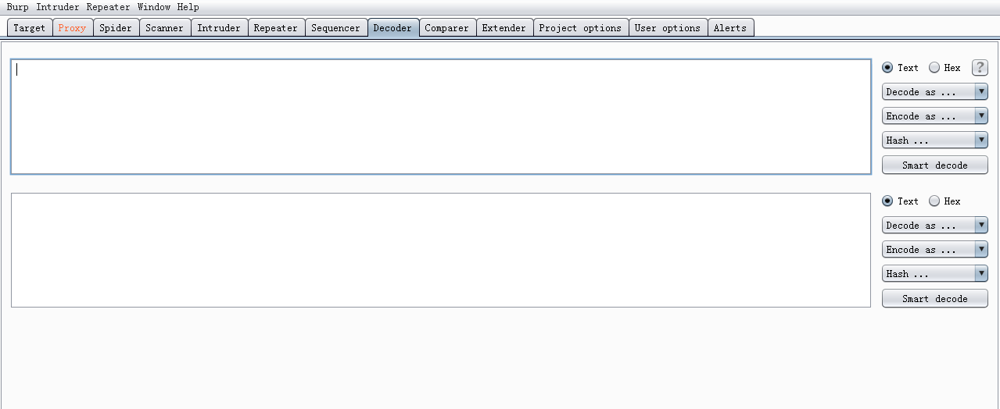

# Burpsuite

> Burp  Suite是Web应用程序测试的最佳工具之一，成为web安全工具中的瑞士军刀。其多种功能可以帮我们执行各种任务.请求的拦截和修改,扫描web应用程序漏洞,以暴力破解登陆表单,执行会话令牌等多种的随机性检查。【属于重量级工具，每个安全从业人员必须会的】但不是开源软件，有其免费版版，但在free版没有主动扫描功能，可用于手动挖掘。【有其破解版，适合个人使用】所有的工具都共享一个能处理并显示HTTP 消息，持久性，认证，代理，日志，警报的一个强大的可扩展的框架。

**提示：** burpsuite为英文版，为防止截断代理出现乱码，对其进行字体调整

### 1.截断代理（Proxy）

> 默认开启，会截断请求的流量，需要手动发送数据包，可以手动暂停

- `intercept`：截断 http/https之间的请求流量

1. `Raw`：显示web请求的raw格式，包括请求地址，http协议版本，主机头，浏览器信息，Accept可接受的内容类型，字符集，编码方式，cookie等。可以手动修改信息，对服务器进行渗透
2. `Param`：显示客户端请求的参数信息，包括Get，Post请求的参数，Cookie参数
3. `headers`：Raw信息
4. `hex`：Raw的二进制内容

- `Httphistory` ：
- `WebSockets history：`
- `Options`：

### 2.Target

> 包含站点地图，目标域，Target工具三个部分，帮助了解目标应用的整体状况，当前的工作涉及哪些目标域，分析可能存在的攻击面

- Target Scope（目标域设置）

主要使用于下面的场景：

1. 限制站点地图和Proxy历史的显示结果
2. 告诉Burp Proxy拦截哪些请求
3. Burp Spider捉取哪些内容
4. Scanner自动扫描哪些作用域的安全漏洞
5. 在intruder和repeater中指定URL

【允许规则和去除规则】

*允许规则：* 在此规则列表中的，视为允许操作，有效。

*去除规则* ：

- 站点地图（Site Map）

- 作用

1. 手工获取站点地图
2. 站点比较
3. 攻击面分析

### 3.Intruder

> 在原始请求数据的基础上，通过修改各种请求参数，一获取不同的请求应答。每一次请求，intruder会携带一个或多个有效攻击载荷（Payload），在不同的位置进行攻击重放，通过应答数据的比较分析来获取需要的特征数据

###### 使用场景和操作步骤

1. 标识符枚举：Web应用程序经常使用标识符来引用用户，账户，资产等数据信息
2. 提取有用的数据:在某些场景下，而不是简单的识别有效标识符，你需要通过简单的标识符来提取一些有用的数据。
3. 模糊测试：很多输入型漏洞，如SQL注入，夸站点脚本和文件路径遍历可以通过请求参数提交各种测试字符串，并分析错误信息和其他异常情况，来应对程序进行检测。由于应用程序的大小和复杂性，手动执行这个测试是一个耗是且繁琐的过程。这样的场景，可以通过设置Payload，通过Intruder自动化对Web应用程序进行模糊测试

### 4.Repeater

> 手工验证Http消息的测试工具，通常用于多次重放请求响应和手工修改消息后对服务器端响应的消息分析

###### Repeater的使用

> > 通常使用Repeater来进行请求与响应的消息验证分析，比如修改请求参数，验证输入漏洞；修改请求参数，验证逻辑越权；从拦截历史记录中，捕获特征性的请求进行重放。

*提示：*左为请求消息区；右为应答消息区

###### 可选项设置

> 可选项设置菜单位于整个界面顶部的菜单栏中

其设置包括以下内容：

- 更新Content-Length：用于控制burp是否自动更新请求消息头的Content-length
- 解压和压缩（Unpack gzip/deflate）:用于控制Burp是否自动解压或压缩服务器响应的内容
- 跳转控制（Follow redirections）：用于控制Burp是否自动跟随服务器端做请求跳转。比如服务器端返回状态码为302，是否跟着应答跳转到302指向的url地址。有四个选项，永不跳转（never），站内跳转（On-site Only），目标域内跳转（In-scope Only），始终跳转（Always），站内跳转是指当前的同一个站点跳转；目标域跳转是指target scope中配置的域可以跳转。
- 跳转中处理Cookie（Process cookies in redirections）：这个选项选中，则在跳转过程中设置Cookie信息，将会被带到跳转指向的URL页面，可以进行提交。
- 视图控制（View）：控制Repeater的视图布局
- 其他操作（Action）：通过子菜单，指向Burp的其他工具组件

### 5.Sequencer

> 检测数据样本随机性质量的工具，通常用于检测访问令牌是否可预测，密码重置令牌是否可预测等场景，通过Sequencer的数据样本分析，能很好地降低这些关键数据被伪造的风险。

### 6.Decoder

> 一款编码解码工具，它能对原始数据进行各种编码格式和散列的转换。

输入域即输入需要解码的原始数据,此处可以直接填写或粘贴,也可以通过其他Burp工具的上下文菜单中【Send to Decoder】;输出域即对输入域进行解码的结果显示出来。无论是输入域还是输出域都支持文本与Hex两种格式,其中编码解码选项中,由解码选项(Decode as)、编码选项(Encode as)、散列(Hash)三个构成。实际使用中,可以根据场景的需要进行设置。对于编码解码选项,目前支持URL、HTML、Base64、ASCII、16进制、8进制、2进制GZIP共八种形式的格式转换,Hash散列支持SHA、SHA-224、SHA-256、SHA-384、SHA-512、MD2、MD5格式的转换,更重要的是,对于同一个数据,我们可以在Decoder的界面,进行多次编码解码的转换。如下图所示:

