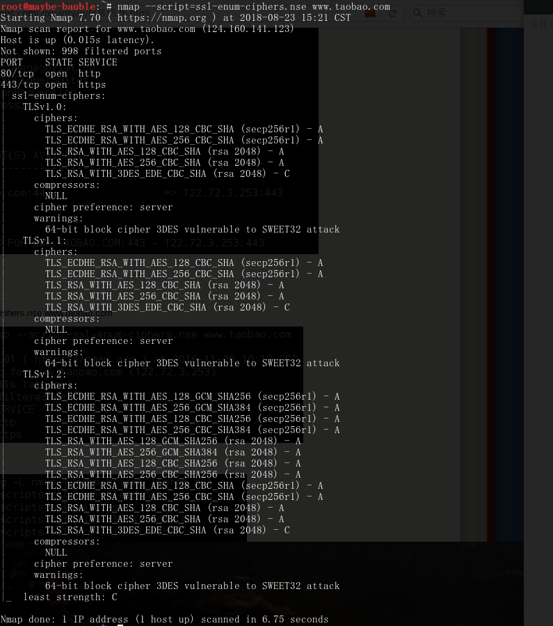

# Https攻击

- 作用：

​      CIA（机密性，完整性，可用性），解决的是信息传输中数据被篡改，窃取【从中注入恶意代码，多为链路劫持】

- Https攻击方法

1. 降级攻击
2. 解密攻击（明文，证书伪造）
3. 协议漏洞，实现方法的漏洞，配置不应该
4. 截断代理

#### 常见的加密算法

- 非对称加密算法

1. Diffie-Hellman key exchange
2. Rivest Shamir Adleman(RSA)   椭圆曲线
3. Elliptic Curve Cryptography(ECC)

- 对称加密算法

1. DES/3DES
2. AES
3. IDEA
4. RC4

- 单向加密算法

| Hash算法 | Hash值长度(bit) |
| -------- | --------------- |
| MD5      | 128             |
| SHA-1    | 160             |
| SHA-2    | 224,256,384,512 |

**注：** SHA-3已经完成设计，但未广泛使用；SHA-2是TLS1.2唯一支持的单向加密算法；碰撞攻击针对单向加密算法（两个不同的文件生成相同的HASH值）

#### SSL的弱点

- SSL是不同的对称，非对称，单向加密算法的组合加密实现

| 加密算法           | SSL实现中的用途                |
| ------------------ | ------------------------------ |
| RSA/Diffie-Hellman | 密钥交换，身份认证             |
| AES                | 加密数据，由RAS/DH完成密钥交换 |
| HMAC-SHA2          | 摘要信息                       |

- 服务器为提供更好的兼容性，选择支持大量过时cipher suite
- 协商过程中强迫降级加密强度
- 现代处理器计算能力可以在可接受的时间内破解过时的加密计算
- 购买云计算资源破解

### 工具使用

#### Openssl

- 直接调用openssl库识别目标服务器支持的SSL/TLS clpher suite
- `openssl s_client -connect www.baidu.com:443`  （查看网站使用的证书：s_client 作为一个客户端  -connect 连接+服务器域名：端口）
- `openssl s_client -tls1_2 -cipher 'ECDH-RSA-RC4-SHA' -connect www.taobao.com:443`测试是否支持某协议，检测对低版本协议的支持
- `openssl s_client -tls1_2 -cipher "NULL,EXPORT,LOW,DES" -connect www.baidu.com:443`测试是否所有不安全的ciphers suite都不支持
- `openssl ciphers -v "NULL,EXPORT,LOW,DES"`查看目前可被破解的cipher suite

#### sslscan

- 可以自动识别SSL配置错误，过期协议，过时cipher suite和hash算法
- 默认检查CRIME，Hreatbleed漏洞
- 绿色表示安全，黄色表示警告，红色表示危险
- `sslscan -tlsall www.baidu.com`  TLS支持的cipher suite
- `sslscan --show-certificate --no-ciphersuites www.taobao.com:443 ` 分析证书详细详细

#### SSLyze

- 检查SSL过时版本
- 检查存在弱点的cipher suite
- 扫描多站点时，支持来源文件（指定扫描文件）
- `sslyze --regular www.taobao.com:443`    检查是否支持会话恢复

#### Nmap

> 使用nmap插件可以实现对SSL的操作

`namp --script=ssl-enum-ciphers.use www.baidu.com`  Nmap枚举SSL脚本

`dpkg -L nmap | grep script | grep ssl`   查询nmap脚本

对SSL进行检查的网站：https://www.ssllabs.com/ssltest/