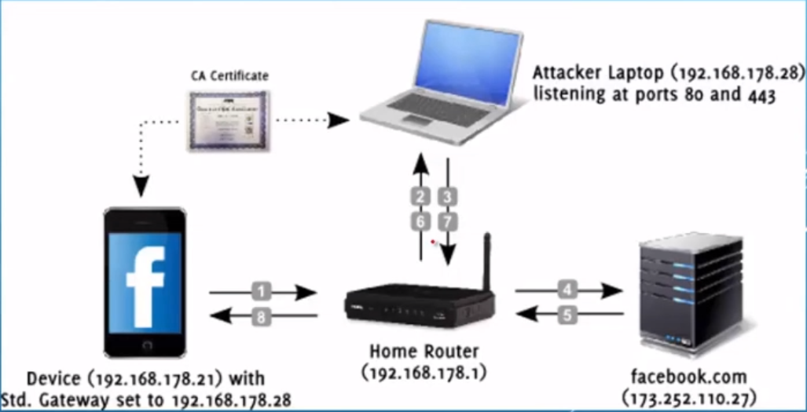

# SSL中间人攻击

> **攻击者位于客户端和服务器端通信链路中：** 
>
> > > ARP
> > >
> > > DHCP
> > >
> > > 修改网关
> > >
> > > 修改DNS
> > >
> > > 修改Hosts
> > >
> > > ICMP，STP，OSPF
>
> 加密流量

> 攻击的前提
>
> > > 客户端已经信任伪造证书颁发机构
> > >
> > > 攻击者控制了合法证书颁发机构
> > >
> > > 客户端程序禁止了显示证书错误告警信息（个人能力限制）
> > >
> > > 攻击者已经控制了客户端，并且强制其信任伪造证书

### 工具使用

#### SSLsplit

